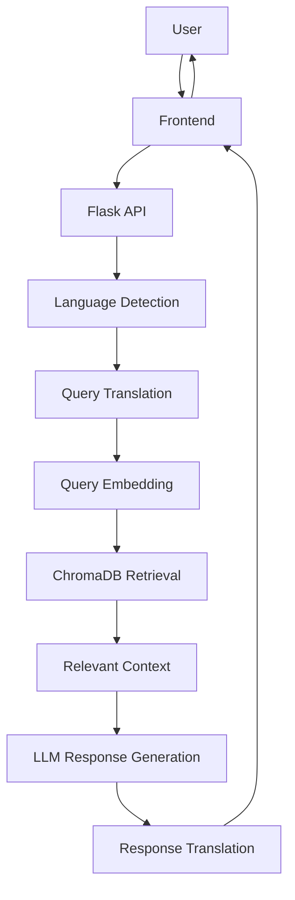

# Elixire — Multilingual Conversational Assistant

A multilingual, retrieval-augmented AI assistant built for **Elixire Pharmacy Management Software**.

The assistant helps pharmacists understand and use the software through **short, simple, step-by-step answers** in multiple languages. It combines language processing, semantic retrieval, and LLM-based generation to ground responses in the application's training resources.

> Developed as part of an industry–academia collaboration.

## Live Demo

**https://elixire-deploy.onrender.com**

---

## Overview

Elixire turns pharmacy training material, such as YouTube transcripts and documentation, into a searchable knowledge base.

When a user asks a question, the system:

1. Detects the user's language.
2. Translates the query into English when required.
3. Retrieves relevant information from the knowledge base.
4. Generates a concise response using the retrieved context.
5. Translates the response back into the user's original language.
6. Returns the formatted answer to the frontend.

The goal is to provide **grounded, practical answers** rather than generic chatbot responses.

---

## Key Features

* **Multilingual interaction** with automatic language detection and translation
* **Retrieval-Augmented Generation (RAG)** for context-grounded responses
* **Semantic search** over pharmacy training material
* **Concise, step-by-step answers** designed for software users
* **Persistent ChromaDB vector storage** for the knowledge base
* **LLM-powered query processing and response generation**
* **Separation between knowledge retrieval and response generation**
* **Web-based interface** for interacting with the assistant

---

## Architecture



### Knowledge Base Pipeline

Training resources are transformed into a searchable vector database:

```text
Training Resources
       ↓
Transcript / Document Processing
       ↓
Cleaning & Chunking
       ↓
Embedding Generation
       ↓
ChromaDB
```

### Query Pipeline

A user's question follows this pipeline:

```text
User Query
    ↓
Language Detection
    ↓
Translation to English
    ↓
Query Embedding
    ↓
ChromaDB Similarity Search
    ↓
Relevant Context
    ↓
LLM Generation
    ↓
Translation to Original Language
    ↓
Final Response
```

---

## Tech Stack

| Component              | Technology                       |
| ---------------------- | -------------------------------- |
| Backend                | Python, Flask                    |
| LLM                    | Groq                             |
| Embeddings             | Gemini                           |
| Vector Database        | ChromaDB                         |
| Embedding Model        | BGE-large / SentenceTransformers |
| Frontend               | React                            |
| Environment Management | `.env`                           |
| Deployment             | Render                           |

---

## Repository Structure

```text
Elixire_Deploy/
│
├── app.py
│   └── Core assistant logic, embeddings, retrieval and LLM operations
│
├── vector_creation.py
│   └── Creates embeddings and builds the ChromaDB knowledge base
│
├── web_server.py
│   └── Flask server and API routes
│
├── frontend/
│   └── React frontend
│
├── chroma_db/
│   └── Persistent ChromaDB vector store
│
├── requirements.txt
│   └── Python dependencies
│
├── .env
│   └── Local environment configuration
│
└── README.md
```

---

## Getting Started

### 1. Clone the repository

```bash
git clone https://github.com/MayenkJoshi37/Elixire_Deploy.git
cd Elixire_Deploy
```

### 2. Create a virtual environment

```bash
python -m venv .venv
```

Activate it on Windows:

```powershell
.venv\Scripts\Activate.ps1
```

Activate it on macOS/Linux:

```bash
source .venv/bin/activate
```

### 3. Install dependencies

```bash
pip install -r requirements.txt
```

### 4. Configure environment variables

Create a `.env` file in the project root.

```env
# Gemini
GEMINI_API_KEY=your_gemini_api_key
EMBEDDING_MODEL=gemini-embedding-001

# Groq
GROQ_API_KEY=your_groq_api_key
GROQ_MODEL_NAME=openai/gpt-oss-120b

# ChromaDB
CHROMA_PATH=./chroma_db
CHROMA_COLLECTION_NAME=elixire_docs_bge_large

# Optional remote ChromaDB source
CHROMA_DB_DOWNLOAD_URL=
CHROMA_DB_DRIVE_FILE_ID=

# Server
PORT=8000
FLASK_DEBUG=false
LOG_LEVEL=INFO

# Retrieval
DEFAULT_N_RESULTS=1
MAX_N_RESULTS=5
```

**Never commit `.env` or API keys to the repository.**

### 5. Run the backend

```bash
python web_server.py
```

The backend runs on:

```text
http://localhost:8000
```

---

## How Retrieval Works

Elixire uses **ChromaDB** as its persistent vector store.

If an existing database is available at:

```text
./chroma_db
```

the application loads it directly.

The application can also initialize the database from a remote source using either:

```env
CHROMA_DB_DOWNLOAD_URL=
```

or:

```env
CHROMA_DB_DRIVE_FILE_ID=
```

When no vector database is available, retrieval returns no document context and the assistant can still generate a response without retrieved knowledge.

---

## Vector Database Creation

The knowledge base is created using `vector_creation.py`.

The general process is:

```text
Training Content
      ↓
Text Extraction
      ↓
Cleaning
      ↓
Chunking
      ↓
BGE-large Embeddings
      ↓
ChromaDB Collection
```

The resulting collection is then used during query-time retrieval.

---

## API

### `POST /chat`

Processes a user query and returns the generated response.

#### Request

```json
{
  "message": "How do I add a new medicine to inventory?",
  "n_results": 1
}
```

#### Example

```bash
curl -X POST http://localhost:8000/chat \
  -H "Content-Type: application/json" \
  -d '{"message":"How do I add a new medicine to inventory?","n_results":1}'
```

#### Response

```json
{
  "success": true,
  "answer": "<formatted response>",
  "used_chunks": ["..."],
  "original_language": "en"
}
```

### `GET /health`

Health-check endpoint used to verify that the backend is running.

```text
GET /health
```

---

## Response Generation

The response generation layer receives:

* the original user query
* processed/translated query information
* retrieved knowledge-base context
* system instructions

The LLM then generates a concise, task-oriented response.

Responses are formatted to make procedural instructions easy to follow, particularly for workflows inside the pharmacy management software.

---

## Multilingual Processing

Elixire is designed to support users who interact with the system in languages other than English.

The processing flow is:

```text
User Message
    ↓
Language Detection
    ↓
Translate → English
    ↓
Retrieve Relevant Context
    ↓
Generate Response
    ↓
Translate ← Original Language
    ↓
User
```

This allows retrieval and generation to operate consistently while preserving the language of the user's interaction.

---

## Environment Variables

| Variable                  | Purpose                                |
| ------------------------- | -------------------------------------- |
| `GEMINI_API_KEY`          | Gemini API authentication              |
| `EMBEDDING_MODEL`         | Embedding model used for vectorization |
| `GROQ_API_KEY`            | Groq API authentication                |
| `GROQ_MODEL_NAME`         | LLM used for processing and generation |
| `CHROMA_PATH`             | Local ChromaDB directory               |
| `CHROMA_COLLECTION_NAME`  | ChromaDB collection name               |
| `CHROMA_DB_DOWNLOAD_URL`  | Optional remote database download URL  |
| `CHROMA_DB_DRIVE_FILE_ID` | Optional Google Drive database file ID |
| `PORT`                    | Flask server port                      |
| `FLASK_DEBUG`             | Flask debug mode                       |
| `LOG_LEVEL`               | Application logging level              |
| `DEFAULT_N_RESULTS`       | Default number of retrieved chunks     |
| `MAX_N_RESULTS`           | Maximum number of retrieved chunks     |

---

## Troubleshooting

### `GEMINI_API_KEY` error

Make sure the key is present in `.env`:

```env
GEMINI_API_KEY=your_key
```

### ChromaDB retrieval is empty

Verify that:

```text
CHROMA_PATH
```

points to a populated ChromaDB directory, or configure one of the supported remote database sources.

### Template / frontend errors

Verify that the frontend files are located in the expected project directory and that the frontend/backend configuration points to the correct API endpoint.

### LLM errors

Check:

```text
GROQ_API_KEY
GROQ_MODEL_NAME
```

and make sure the selected model is available to your Groq account.

### Dependency errors

Recreate the environment and reinstall:

```bash
python -m venv .venv
```

```bash
pip install -r requirements.txt
```

---

## Security

Do not commit secrets or credentials.

Add `.env` to `.gitignore`:

```gitignore
.env
.venv/
__pycache__/
```

When deploying the application publicly, API keys should be stored as environment variables through the deployment platform rather than inside source code.

For a production deployment, the `/chat` endpoint should also be protected against abuse through appropriate authentication and/or rate limiting.

---

## Development

Useful areas for future development include:

* expanding the knowledge base
* improving document chunking and retrieval
* adding evaluation for retrieval quality
* improving multilingual accuracy
* adding automated tests for the assistant pipeline
* improving observability and logging

---

## License

This project is released under the **MIT License**.

---

## Author

**Mayenk Joshi**

GitHub: [MayenkJoshi37](https://github.com/MayenkJoshi37)
